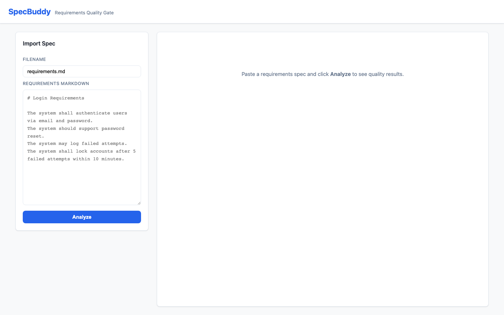
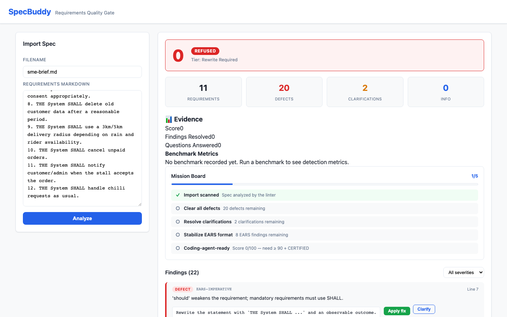
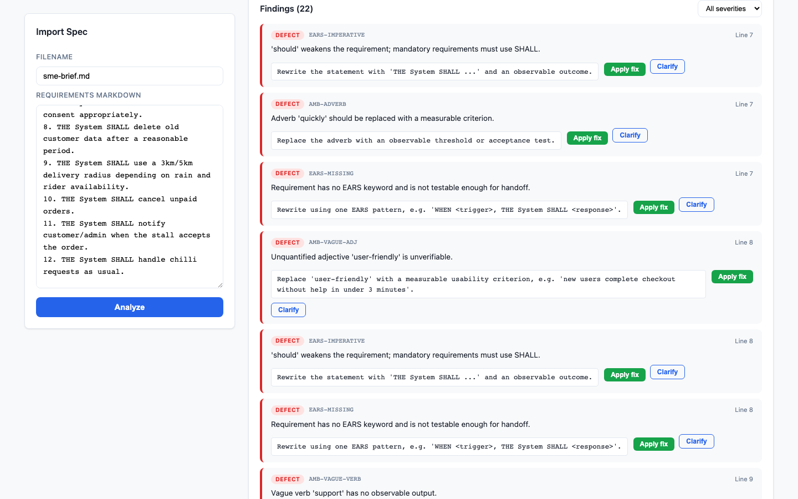
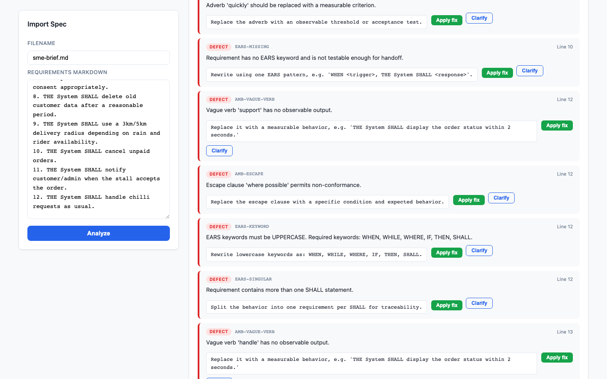
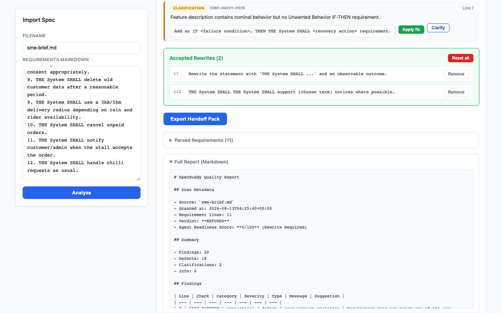

# SpecBuddy

SpecBuddy is a requirements quality gate that helps teams turn rough
requirements into coding-agent-ready specifications before implementation
begins.

Same coding agent. Clearer specs in. Better software out.

## What It Does

- **Checks requirements before code is written** so vague intent does not silently
  turn into bad implementation.
- **Flags ambiguous and unverifiable language** including vague adjectives,
  unquantified adverbs, passive voice, pronoun ambiguity, oblique symbols, and
  escape clauses.
- **Enforces EARS-style acceptance criteria** so requirements become observable,
  testable behavior.
- **Scores specification readiness** with a deterministic verdict, severity
  counts, and line-level findings.
- **Suggests deterministic rewrites** and lets users apply supported single-line
  fixes without mutating the original raw Markdown.
- **Exports a Markdown quality report** for handoff to CodeBuddy or another
  coding agent.

## Why

Bad requirements do not usually fail loudly. They fail quietly later as bugs,
rework, inconsistent agent behavior, missed edge cases, and features no one can
trace back to the original requirement.

SpecBuddy addresses the root problem: coding agents are only as good as the
specifications they receive.

## Current Scope

SpecBuddy currently accepts Markdown requirements. In real delivery, that
Markdown can come from BA notes, PRDs, meeting minutes, whiteboards, or
collaboration tools. Source integrations are future work.

The app is a local-first full-stack wrapper around a frozen deterministic Python
linter:

- **FastAPI + SQLite** backend in `backend/`
- **React/Vite/TypeScript** frontend in `frontend/`
- **Python standard-library linter core** in `src/linter/`

The wrapper consumes the frozen core and does not reimplement linter logic. The
first SpecBuddy version has no auth, cloud deployment, collaboration layer,
external integrations, or AI/network calls for rewrites.

## How It Works

Paste requirements.md -> analyze -> review findings -> apply deterministic fixes
-> rescore -> export report.

**1. Paste a rough spec.** The import panel accepts a Markdown requirements
draft.



**2. Analyze the spec.** SpecBuddy returns a readiness score and verdict,
per-severity stats, line-level findings, and a Mission Board.



**3. Review line-level findings.** Every finding maps to a line, a check ID, a
severity, and a deterministic rewrite suggestion where available.



**4. Apply a fix and rescore.** Applying a suggested rewrite reruns the frozen
linter immediately, improving the score when the spec becomes clearer.



**5. Track progress on the Mission Board.** Missions are derived in the frontend
from current findings, score, and verdict.


**6. Export the Markdown report.** Accepted rewrites are visible and reversible,
and the full report is available as Markdown for coding-agent handoff.



## Target Users

- Business Analysts
- Product Managers
- Engineering Managers
- Vibe coders and AI-assisted builders
- Delivery teams working with coding agents

## Requirements

- **CLI core**: Python 3.11+, standard library only
- **Backend wrapper**: install `requirements-backend.txt`
- **Frontend**: run `npm install` inside `frontend/`

## Running Tests And Builds

```bash
python3 -m unittest discover -s tests
python3 -m unittest discover -s tests_backend
cd frontend && npm run build
```

## Running The CLI

The internal command name is preserved for the first safe rebrand:

```bash
python3 -m linter.claritygate <path-to-requirements.md> [--out <report-path>]
```

Example:

```bash
python3 -m linter.claritygate data/samples/ambiguous-requirements.md --out /tmp/specbuddy-report.md
```

### Exit Codes

| Code | Meaning |
|------|---------|
| `0` | Spec certified, with no refusal-level findings |
| `2` | Spec refused because refusal-level findings were detected |

## Running The Full-Stack Demo

Start the backend from the repo root:

```bash
python3 -m uvicorn backend.main:create_app --factory --host 127.0.0.1 --port 8000
```

Start the frontend from `frontend/`:

```bash
npm run dev -- --host 127.0.0.1 --port 5173
```

Then open `http://127.0.0.1:5173`.

## Project Layout

```text
SpecBuddy/
├── README.md
├── requirements-backend.txt
├── src/linter/              # Frozen deterministic linter implementation
├── linter/                  # Compatibility shim for python -m linter.claritygate
├── backend/                 # FastAPI + SQLite wrapper
├── frontend/                # React/Vite demo UI
├── tests/                   # stdlib unittest suite for the core
├── tests_backend/           # backend wrapper unittest suite
├── data/samples/            # demo input files
├── docs/                    # demo and submission materials
└── specs/                   # product specification notes
```
